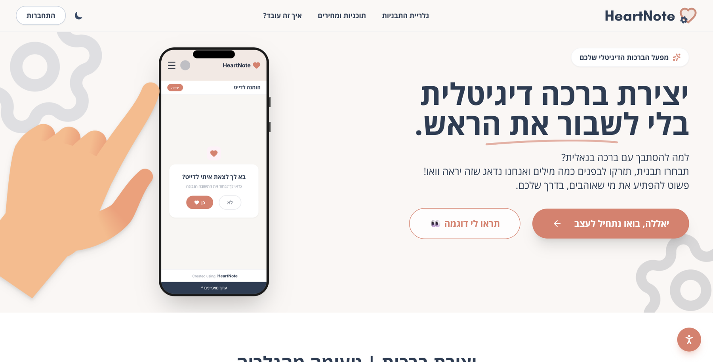
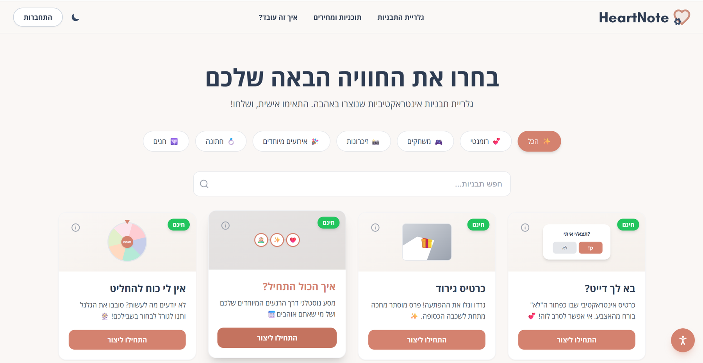
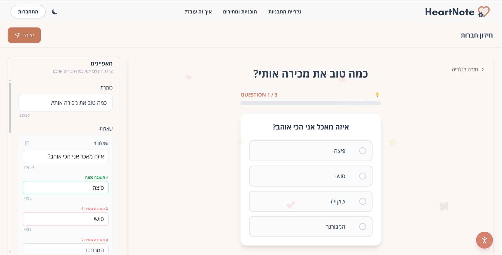
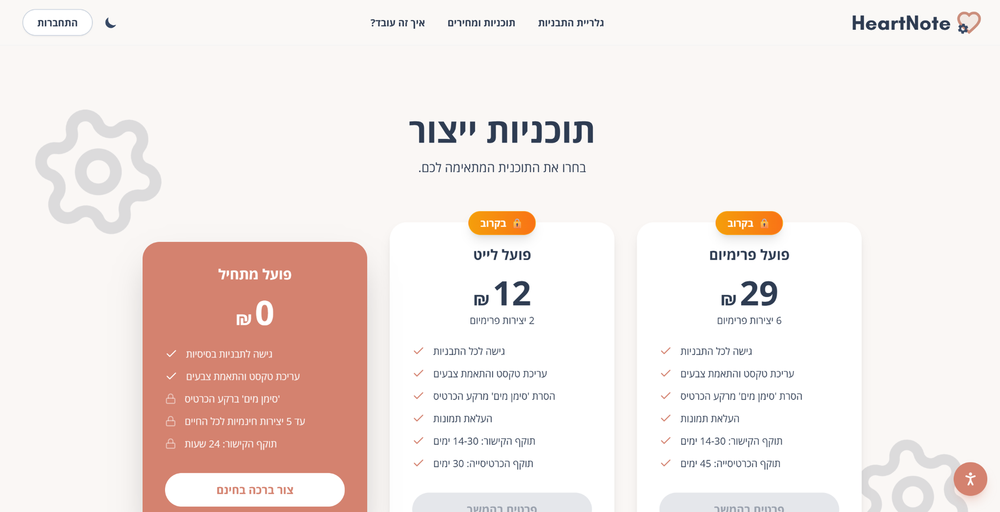
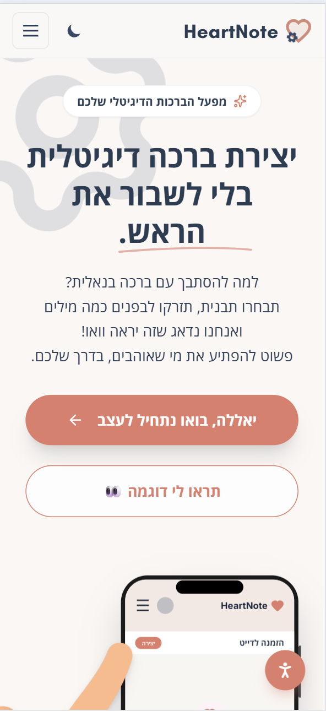
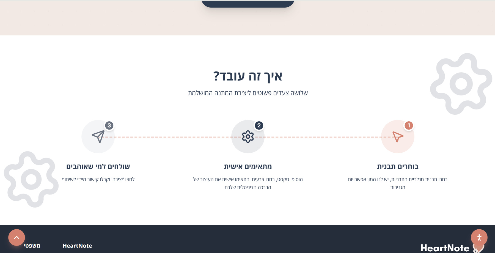
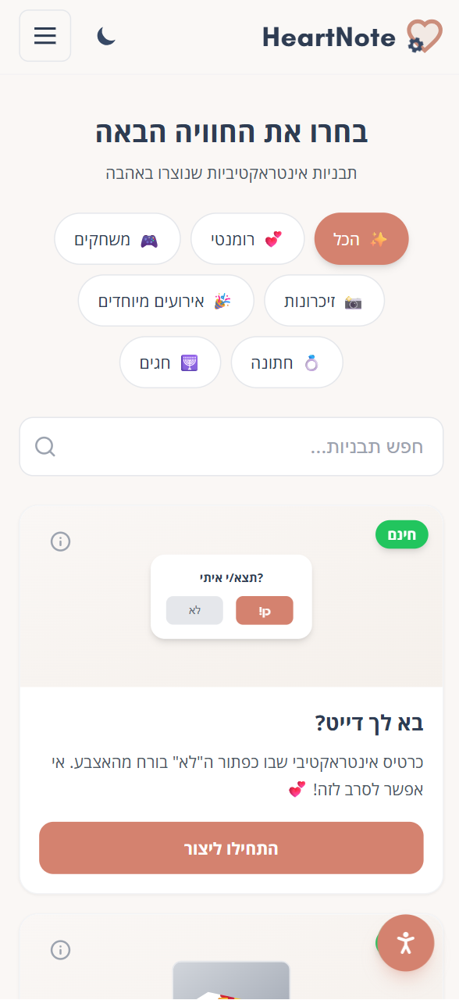
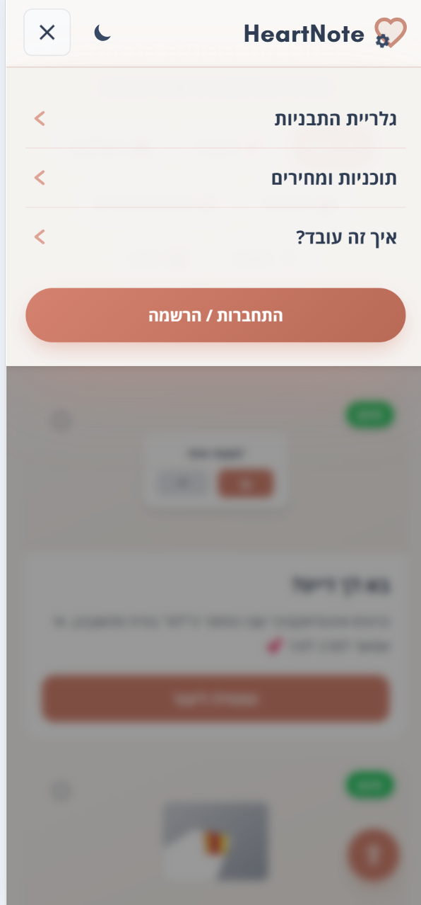

# HeartNote Product Walkthrough

This walkthrough focuses on the product, brand and UI/UX decisions I owned or directly shaped as a co-founder of HeartNote.

The full production system was built collaboratively with Ilay Admoni. My primary contribution was product concept, brand identity, UI/UX, interactive greeting concepts, content direction and front-end experience.

## 1. Landing and positioning

The landing page needed to explain the product in seconds: HeartNote is not a generic card editor, but a way to create a digital greeting that feels like a small interactive experience.

The page therefore prioritizes:

- a direct value proposition
- strong visual identity
- a clear primary CTA into creation
- a secondary path to view an example
- a visible product preview inside a phone mockup
- Hebrew-first hierarchy and RTL behavior

The visual language uses warm neutrals, coral accents, soft rounded surfaces and playful illustration without letting the decoration compete with the main action.

## 2. Discovering the right experience

The gallery is a product discovery surface, not just a template list.

Users can browse by occasion and experience type, search the library and understand which options are free or premium before entering the editor.

The main UX goals were:

- reduce decision fatigue
- make category differences understandable at a glance
- let the interaction concept sell the greeting
- keep free and paid boundaries visible
- make browsing feel playful without becoming visually noisy

## 3. Guided customization with live preview

Different greetings require different inputs. A quiz needs questions and answers, while an animated birthday experience may need a greeting, a name and interaction-specific controls.

Instead of forcing all templates into one generic form, the editor adapts to the selected experience.

The desktop layout deliberately keeps controls beside the live preview so the sender can understand the effect of each change immediately.

This supports an important product principle: personalization should feel guided rather than technical.

## 4. Designing different interaction concepts

HeartNote templates are designed as different product experiences, not only different visual skins.

For example, the birthday experience uses an illustrated cake and candle interaction. Other templates use quizzes, reveals, choices, games or occasion-specific scenes.

My work in this area included translating an emotional or playful idea into:

1. an interaction the recipient can understand immediately
2. a manageable set of customization fields for the sender
3. a coherent visual direction
4. a responsive experience that still works on smaller screens

## 5. Making the journey easy to understand

The core product journey is intentionally simple:

1. choose a template
2. personalize it
3. create and share

The product can contain complex interaction logic behind the scenes, but the user should not need to understand that complexity.

This three-step model shaped navigation, microcopy, CTA hierarchy and onboarding decisions throughout the product.

## 6. Monetization without hiding the free path

HeartNote combines free creation with paid options.

From a product perspective, the pricing experience needed to make the difference between tiers understandable while still allowing someone to experience the core value before paying.

The interface separates:

- free creation
- lower-cost paid creation
- a broader premium option

The wider product continues to evolve, so pricing and packaging can change as we learn more about user behavior and willingness to pay.

## 7. Mobile as a primary product surface

Greeting creation and sharing are naturally mobile behaviors. The responsive experience was therefore treated as a product flow of its own rather than a smaller copy of the desktop page.

The mobile landing changes composition, hierarchy and visual placement while preserving the same brand and product promise.

## 8. Mobile discovery

On mobile, categories become large touch targets and the gallery moves into a vertically scannable card system.

Important considerations included:

- tap-friendly controls
- readable Hebrew typography
- clear visual separation between cards
- persistent understanding of free and premium states
- keeping search and category filters accessible without overwhelming the screen

## What this case study demonstrates

HeartNote is especially important in my portfolio because it combines several areas of product work in one live collaborative product:

- co-founding and product definition
- brand strategy and visual identity
- information architecture
- UI/UX across discovery, creation, preview and sharing
- interactive experience design
- responsive Hebrew-first design
- monetization decisions
- front-end implementation
- ongoing iteration with a technical co-founder

The production repository contains the full system. This showcase intentionally focuses on the parts of the product I owned or directly shaped.
